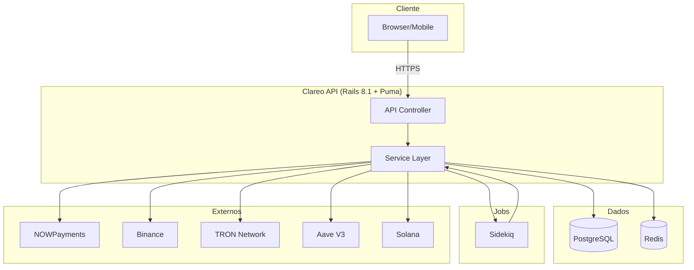
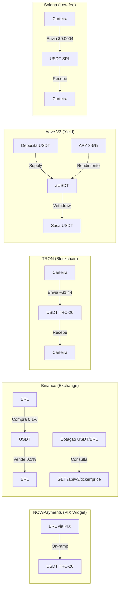
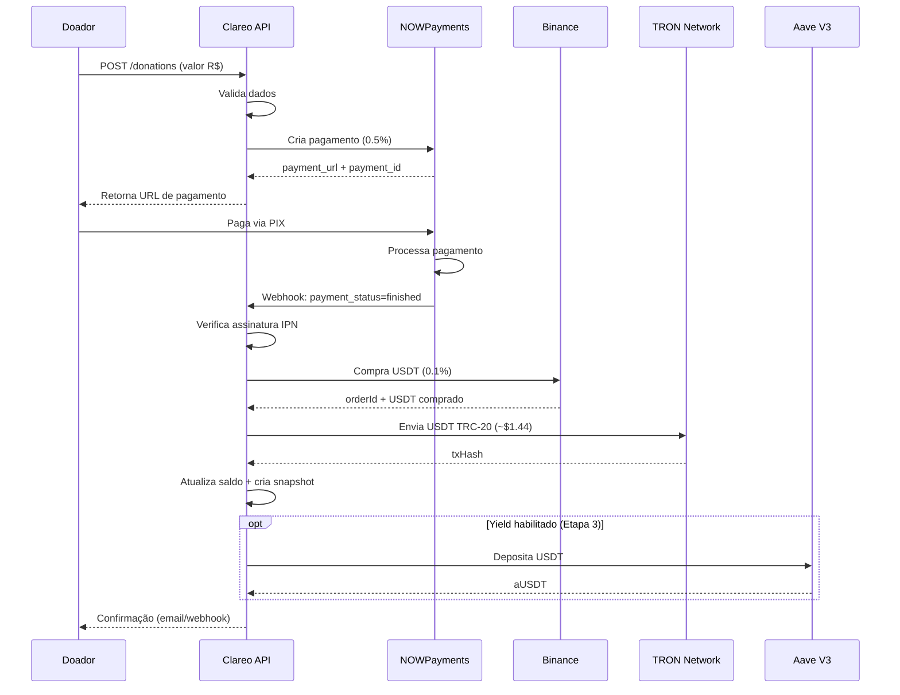
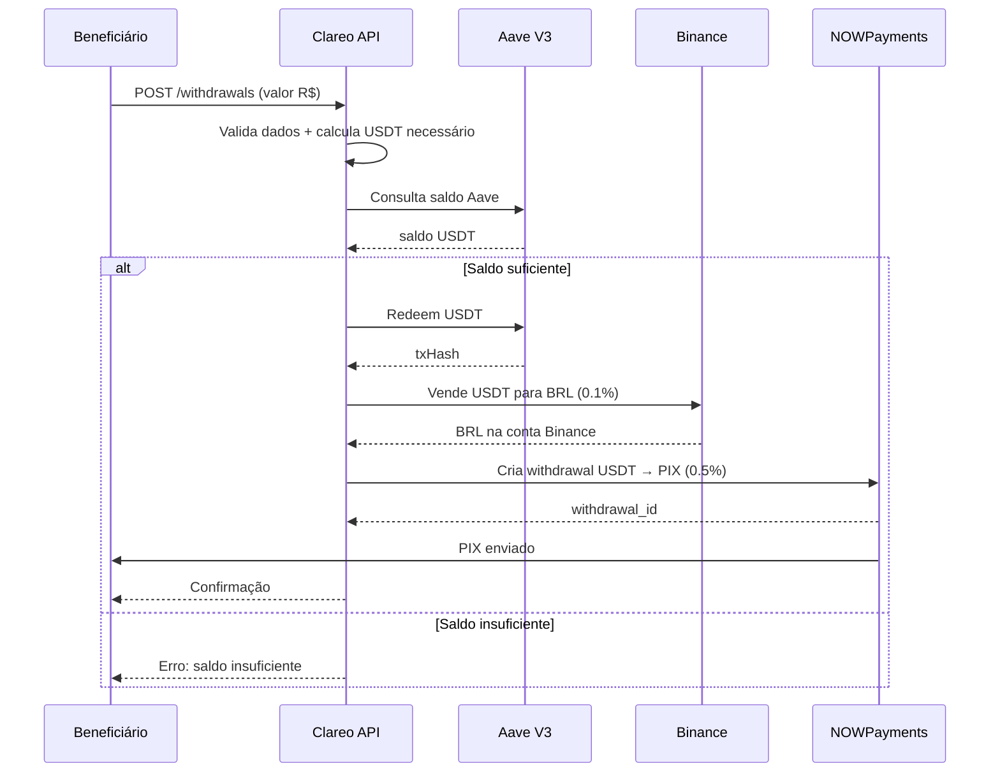
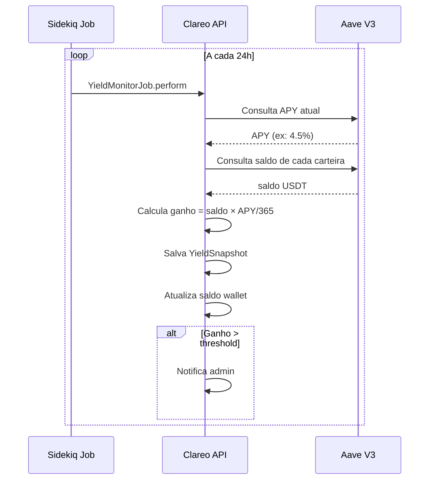
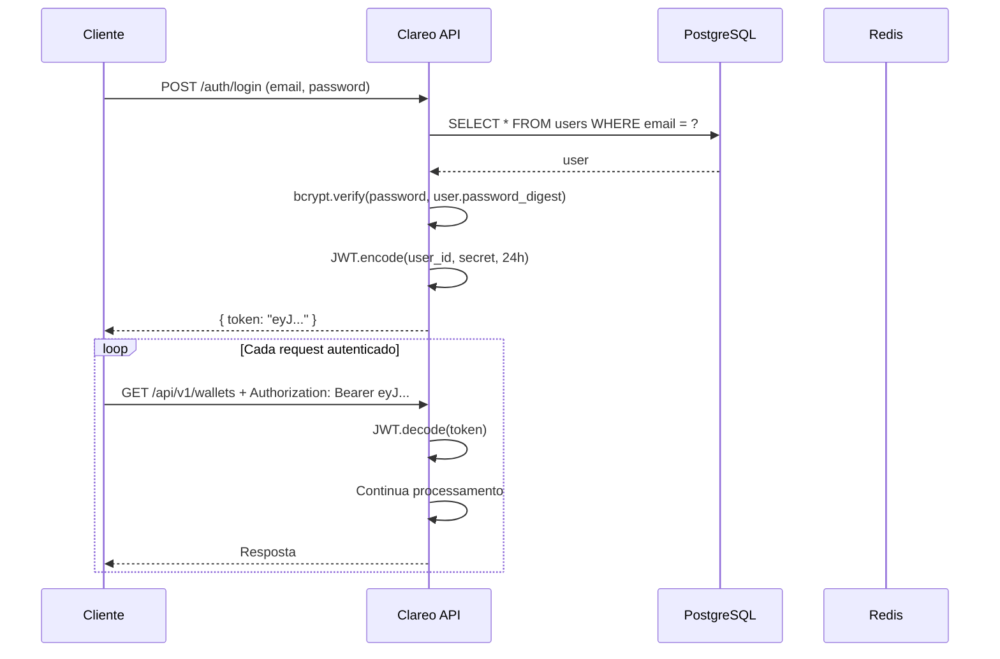

# Clareo — Diagramas de Fluxo

## 1. Visão Geral do Sistema



---

## 2. APIs Externas — O que cada uma faz



---

## 3. Fluxo de Doação (Passo a passo)



### Status da Doação

```
pending → confirmed → failed
   │          │
   │          └── USDT convertido e depositado
   └── Pagamento criado no NOWPayments
```

---

## 4. Fluxo de Saque (Passo a passo)



### Status do Saque

```
pending → processing → completed → failed
   │          │           │
   │          │           └── PIX enviado
   │          └── Sacando do Aave + convertendo
   └── Solicitação criada
```

---

## 5. Fluxo de Yield (Monitoramento)



---

## 6. Fluxo de Autenticação



---

## 7. Resumo das Integrações

| API | O que faz | Quando usa | Custo |
|-----|-----------|------------|-------|
| **NOWPayments** | On-ramp (PIX→USDT) | Doação | 0.5% |
| **Binance** | Compra/venda USDT | Doação + Saque | 0.1% |
| **TRON** | Blockchain, carteiras | Doação + Saque | ~$1.44 |
| **Aave V3** | Yield (deposito/saque) | Yield | Gas only |
| **Solana** | Low-fee transfers | Micro-transações | $0.0004 |
