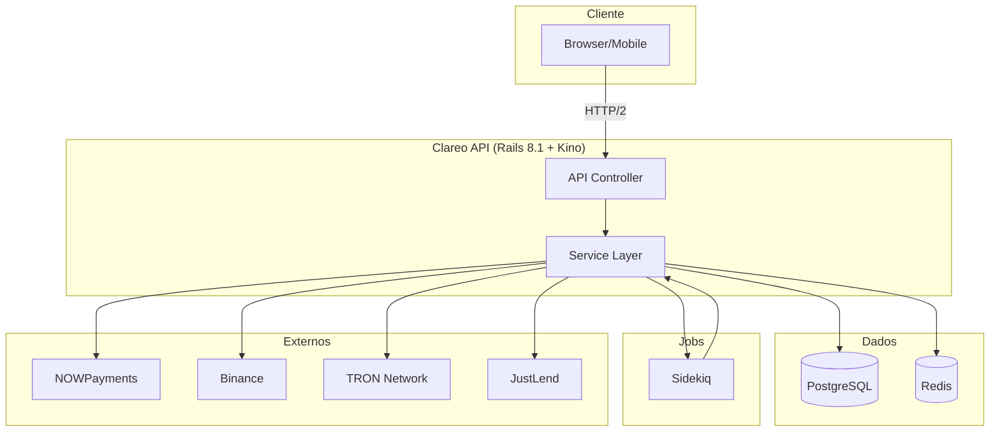
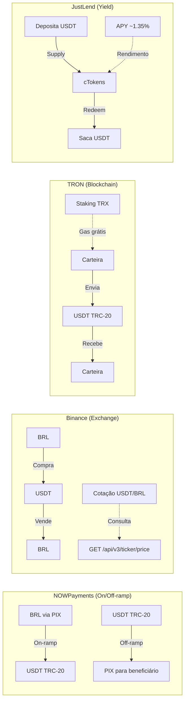
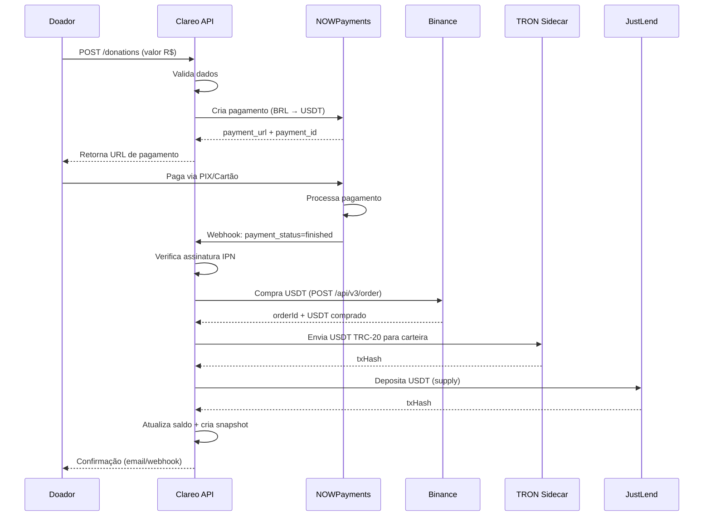
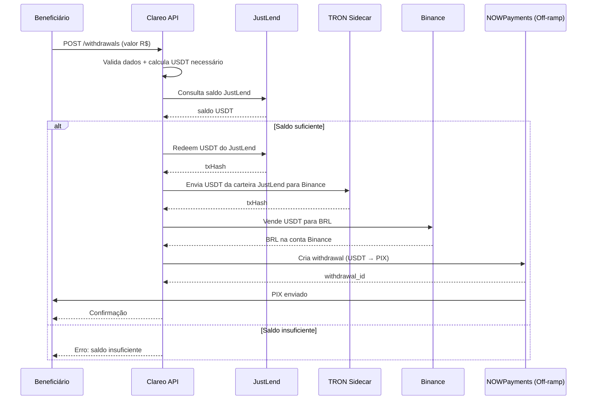
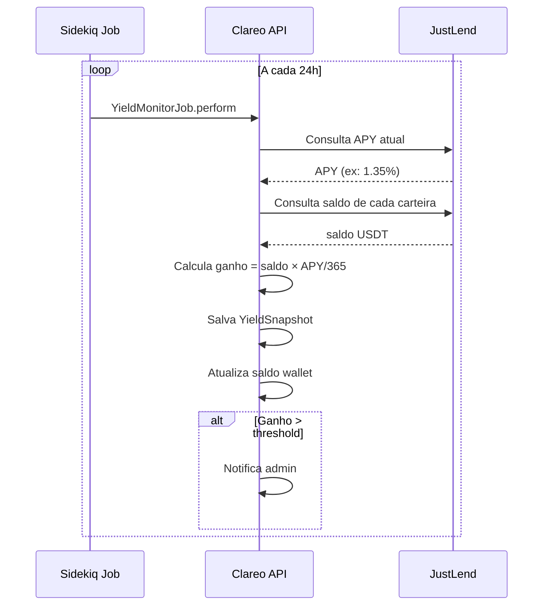
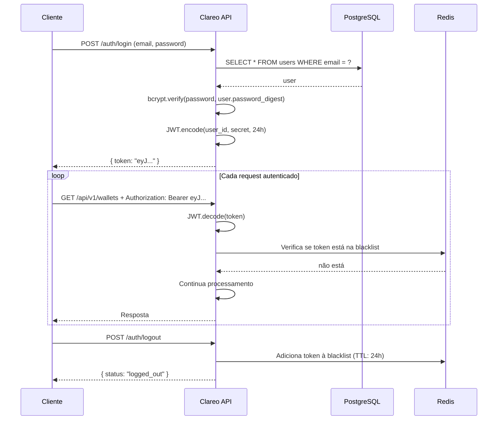
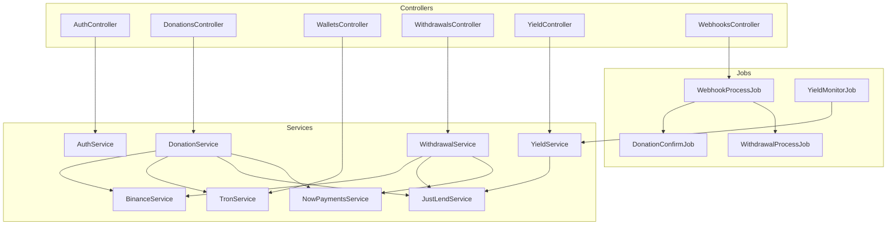
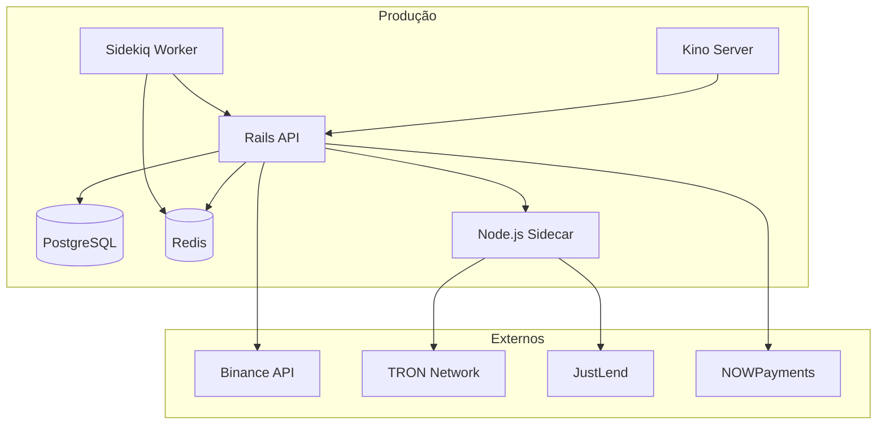

# Clareo — Diagramas de Fluxo

## 1. Visão Geral do Sistema



---

## 2. APIs Externas — O que cada uma faz



---

## 3. Fluxo de Doação (Passo a passo)



### Status da Doação

```
pending → confirmed → failed
   │          │
   │          └── USDT convertido e depositado
   └── Pagamento criado no NOWPayments
```

---

## 4. Fluxo de Saque (Passo a passo)



### Status do Saque

```
pending → processing → completed → failed
   │          │           │
   │          │           └── PIX enviado
   │          └── Sacando do JustLend + convertendo
   └── Solicitação criada
```

---

## 5. Fluxo de Yield (Monitoramento)



### Snapshot contém

| Campo | Descrição |
|-------|-----------|
| `balance` | Saldo naquele momento |
| `apy` | APY do JustLend |
| `earned` | Ganhos acumulados |
| `date` | Data do snapshot |

---

## 6. Fluxo de Autenticação



---

## 7. Arquitetura de Services



---

## 8. Diagrama de Deploy



---

## Resumo das Integrações

| API | O que faz | Quando usa | Custo |
|-----|-----------|------------|-------|
| **NOWPayments** | On-ramp (PIX→USDT) e Off-ramp (USDT→PIX) | Doação + Saque | 1-2% |
| **Binance** | Compra/venda USDT, cotação | Doação + Saque | 0.1% |
| **TRON** | Blockchain, carteiras, transferências | Doação + Saque | ~$0.01 |
| **JustLend** | Yield (deposito/saque USDT) | Yield + Saque | Gas only |
