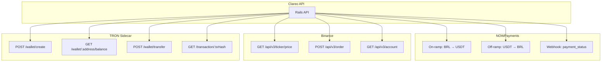

# Clareo — APIs Externas Detalhadas (MVP)

## Mapa das Integrações



---

## NOWPayments — Detalhes

### O que é
Gateway de pagamento que aceita PIX e converte para USDT.

### Quando usar
- **Doação:** Doador paga R$ via PIX → NOWPayments converte para USDT
- **Saque:** Instituição solicita saque → NOWPayments envia PIX

### Endpoints

| Endpoint | Método | O que faz |
|----------|--------|-----------|
| `/v1/payment` | POST | Cria pagamento (on-ramp) |
| `/v1/payment/:id` | GET | Consulta status |
| `/v1/payout` | POST | Envia PIX (off-ramp) |

### Fluxo Doação

```
Doador (PIX) → NOWPayments → USDT TRC-20 → Clareo
```

### Fluxo Saque

```
Clareo → USDT → NOWPayments → PIX → Instituição
```

### Webhook (IPN)

```
NOWPayments → POST /api/v1/webhooks/nowpayments → Clareo
```

---

## Binance — Detalhes

### O que é
Exchange de cripto com a maior liquidez para pares BRL/USDT.

### Quando usar
- **Doação:** Comprar USDT com BRL recebido
- **Saque:** Vender USDT para BRL
- **Cotação:** Consultar preço em tempo real

### Endpoints

| Endpoint | Método | O que faz |
|----------|--------|-----------|
| `/api/v3/ticker/price` | GET | Cotação USDT/BRL |
| `/api/v3/order` | POST | Criar ordem de compra/venda |
| `/api/v3/account` | GET | Consultar saldos |

### Autenticação HMAC-SHA256

```
X-MBX-APIKEY: sua_api_key
Signature: HMAC-SHA256(query_string, api_secret)
```

---

## TRON Sidecar — Detalhes

### O que é
Node.js que roda TronWeb para interagir com a blockchain TRON.

### Endpoints

| Endpoint | Método | O que faz |
|----------|--------|-----------|
| `/wallet/create` | POST | Cria nova carteira |
| `/wallet/:address/balance` | GET | Consulta saldo USDT |
| `/wallet/transfer` | POST | Envia USDT TRC-20 |
| `/transaction/:txHash` | GET | Verifica status tx |

### Endereço do Contrato USDT

```
TR7NHqjeKQxGTCi8q8ZY4pL8otSzgjLj6t
```

---

## Resumo de Custos por Transação

| Ação | NOWPayments | Binance | TRON | Total |
|------|-------------|---------|------|-------|
| Doação R$100 | ~R$0.50 | ~R$0.10 | ~R$1.44 | **R$2.04** |
| Saque R$100 | ~R$0.50 | ~R$0.10 | - | **R$0.60** |
| Consulta cotação | - | Grátis | - | Grátis |
| Consulta saldo | - | Grátis | Grátis | Grátis |
