# Clareo — APIs Externais Detalhadas

## Mapa das Integrações

```mermaid
graph TB
    subgraph "Clareo API"
        API[Rails API]
    end

    subgraph "NOWPayments"
        N1[On-ramp: BRL → USDT]
        N2[Off-ramp: USDT → BRL]
        N3[Webhook: payment_status]
    end

    subgraph "Binance"
        B1[GET /api/v3/ticker/price]
        B2[POST /api/v3/order]
        B3[GET /api/v3/account]
    end

    subgraph "TRON Sidecar"
        T1[POST /wallet/create]
        T2[GET /wallet/:address/balance]
        T3[POST /wallet/transfer]
        T4[GET /transaction/:txHash]
    end

    subgraph "JustLend"
        J1[GET /justlend/apy]
        J2[POST /justlend/supply]
        J3[POST /justlend/redeem]
        J4[GET /justlend/balance/:address]
    end

    API --> N1
    API --> N2
    API --> N3
    API --> B1
    API --> B2
    API --> B3
    API --> T1
    API --> T2
    API --> T3
    API --> T4
    API --> J1
    API --> J2
    API --> J3
    API --> J4
```



---

## NOWPayments — Detalhes

### O que é
Gateway de pagamento que aceita cripto e fiat via PIX, cartão, boleto.

### Quando usar
- **Doação:** Doador paga R$ → NOWPayments converte para USDT
- **Saque:** Beneficiário saca USDT → NOWPayments envia PIX

### Endpoints

| Endpoint | Método | O que faz |
|----------|--------|-----------|
| `/v1/payment` | POST | Cria pagamento (on-ramp) |
| `/v1/payment/:id` | GET | Consulta status |
| `/v1/withdrawal` | POST | Cria saque (off-ramp) |

### Fluxo On-ramp

```
Doador (PIX) → NOWPayments → USDT TRC-20 → Clareo
```

### Fluxo Off-ramp

```
Clareo → USDT TRC-20 → NOWPayments → PIX → Beneficiário
```

### Webhook (IPN)

```
NOWPayments → POST /api/v1/webhooks/nowpayments → Clareo
```

Payload:
```json
{
  "payment_id": 12345,
  "payment_status": "finished",
  "order_id": "donation_abc123",
  "price_amount": 100.00,
  "price_currency": "brl",
  "amount": 19.76,
  "amount_currency": "usdttrc20"
}
```

---

## Binance — Detalhes

### O que é
Exchange de cripto com a maior liquidez para pares BRL/USDT.

### Quando usar
- **Doação:** Comprar USDT com BRL recebido
- **Saque:** Vender USDT para BRL
- **Cotação:** Consultar preço em tempo real

### Endpoints

| Endpoint | Método | O que faz |
|----------|--------|-----------|
| `/api/v3/ticker/price` | GET | Cotação USDT/BRL |
| `/api/v3/order` | POST | Criar ordem de compra/venda |
| `/api/v3/account` | GET | Consultar saldos |

### Autenticação HMAC-SHA256

```
X-MBX-APIKEY: sua_api_key
Signature: HMAC-SHA256(query_string, api_secret)
```

### Exemplo de compra

```
1. GET /api/v3/ticker/price?symbol=USDTBRL → 5.05
2. Aplica spread: 5.05 × 1.002 = 5.06
3. Calcula quantidade: R$100 / 5.06 = 19.76 USDT
4. POST /api/v3/order { symbol: USDTBRL, side: BUY, quantity: 19.76 }
```

---

## TRON Sidecar — Detalhes

### O que é
Node.js que roda TronWeb para interagir com a blockchain TRON.

### Por que Sidecar?
- TronWeb é JavaScript (não existe gem Ruby madura)
- Conexão persistente com a rede TRON
- Rails se comunica via HTTP com o sidecar

### Endpoints

| Endpoint | Método | O que faz |
|----------|--------|-----------|
| `/wallet/create` | POST | Cria nova carteira |
| `/wallet/:address/balance` | GET | Consulta saldo USDT |
| `/wallet/transfer` | POST | Envia USDT TRC-20 |
| `/transaction/:txHash` | GET | Verifica status tx |
| `/justlend/apy` | GET | Consulta APY JustLend |
| `/justlend/supply` | POST | Deposita USDT no JustLend |
| `/justlend/redeem` | POST | Saca USDT do JustLend |
| `/justlend/balance/:address` | GET | Saldo no JustLend |

### Endereço do Contrato USDT

```
TR7NHqjeKQxGTCi8q8ZY4pL8otSzgjLj6t
```

---

## JustLend — Detalhes

### O que é
Protocolo de lending na TRON — deposita USDT e recebe yield (~1.35% APY).

### Como funciona

```
Deposita USDT → Recebe cTokens → cTokens geram yield → Saca USDT
```

### Endpoints

| Endpoint | Método | O que faz |
|----------|--------|-----------|
| `/justlend/apy` | GET | Consulta APY atual |
| `/justlend/supply` | POST | Deposita USDT |
| `/justlend/redeem` | POST | Saca USDT |
| `/justlend/balance/:address` | GET | Saldo em cTokens + USDT |

### Contratos

| Contrato | Endereço |
|----------|----------|
| Comptroller | `TX7QNd8Vr7VgqgvXkEBK5RBX6jTJFm5vA` |
| cUSDT | `TBDZs8sHXY8dBX9rYJbE9U8V2Hm4q5J2w` |
| USDT | `TR7NHqjeKQxGTCi8q8ZY4pL8otSzgjLj6t` |

### Fluxo

```
1. Aprovar USDT para JustLend (approve)
2. Depositar USDT (mint) → recebe cTokens
3. cTokens crescem a cada bloco (yield)
4. Saca USDT (redeem) → devolve cTokens + juros
```

---

## Resumo de Custos por Transação

| Ação | NOWPayments | Binance | TRON | JustLend |
|------|-------------|---------|------|----------|
| Doação R$100 | ~R$1.50 | ~R$0.10 | ~$0.01 | Gas |
| Saque R$100 | ~R$1.50 | ~R$0.10 | ~$0.01 | Gas |
| Consulta cotação | - | Grátis | - | - |
| Consulta saldo | - | Grátis | Grátis | Grátis |
