# Clareo — APIs Externas Detalhadas

## Mapa das Integrações

```mermaid
graph TB
    subgraph "Clareo API"
        API[Rails API]
    end

    subgraph "NOWPayments"
        N1[On-ramp: BRL → USDT]
        N3[Webhook: payment_status]
    end

    subgraph "Binance"
        B1[GET /api/v3/ticker/price]
        B2[POST /api/v3/order]
        B3[GET /api/v3/account]
    end

    subgraph "TRON Sidecar"
        T1[POST /wallet/create]
        T2[GET /wallet/:address/balance]
        T3[POST /wallet/transfer]
        T4[GET /transaction/:txHash]
    end

    subgraph "Aave V3"
        A1[POST /aave/supply]
        A2[POST /aave/withdraw]
        A3[GET /aave/balance/:address]
        A4[GET /aave/apy]
    end

    API --> N1
    API --> N3
    API --> B1
    API --> B2
    API --> B3
    API --> T1
    API --> T2
    API --> T3
    API --> T4
    API --> A1
    API --> A2
    API --> A3
    API --> A4
```



---

## NOWPayments — Detalhes

### O que é
Gateway de pagamento que aceita PIX e converte para USDT.

### Quando usar
- **Doação:** Doador paga R$ via PIX → NOWPayments converte para USDT

### Endpoints

| Endpoint | Método | O que faz |
|----------|--------|-----------|
| `/v1/payment` | POST | Cria pagamento (on-ramp) |
| `/v1/payment/:id` | GET | Consulta status |

### Fluxo

```
Doador (PIX) → NOWPayments → USDT TRC-20 → Clareo
```

### Webhook (IPN)

```
NOWPayments → POST /api/v1/webhooks/nowpayments → Clareo
```

---

## Binance — Detalhes

### O que é
Exchange de cripto com a maior liquidez para pares BRL/USDT.

### Quando usar
- **Doação:** Comprar USDT com BRL recebido
- **Saque:** Vender USDT para BRL
- **Cotação:** Consultar preço em tempo real

### Endpoints

| Endpoint | Método | O que faz |
|----------|--------|-----------|
| `/api/v3/ticker/price` | GET | Cotação USDT/BRL |
| `/api/v3/order` | POST | Criar ordem de compra/venda |
| `/api/v3/account` | GET | Consultar saldos |

### Autenticação HMAC-SHA256

```
X-MBX-APIKEY: sua_api_key
Signature: HMAC-SHA256(query_string, api_secret)
```

---

## TRON Sidecar — Detalhes

### O que é
Node.js que roda TronWeb para interagir com a blockchain TRON.

### Endpoints

| Endpoint | Método | O que faz |
|----------|--------|-----------|
| `/wallet/create` | POST | Cria nova carteira |
| `/wallet/:address/balance` | GET | Consulta saldo USDT |
| `/wallet/transfer` | POST | Envia USDT TRC-20 |
| `/transaction/:txHash` | GET | Verifica status tx |

### Endereço do Contrato USDT

```
TR7NHqjeKQxGTCi8q8ZY4pL8otSzgjLj6t
```

---

## Aave V3 — Detalhes

### O que é
Maior protocolo de lending descentralizado — deposita USDT e recebe yield (3-5% APY).

### Como funciona

```
Deposita USDT → Recebe aUSDT → aUSDT gera yield → Saca USDT
```

### Endpoints

| Endpoint | Método | O que faz |
|----------|--------|-----------|
| `/aave/apy` | GET | Consulta APY atual |
| `/aave/supply` | POST | Deposita USDT |
| `/aave/withdraw` | POST | Saca USDT |
| `/aave/balance/:address` | GET | Saldo em aUSDT + USDT |

### Contratos

| Contrato | Endereço (Ethereum) |
|----------|---------------------|
| Aave Pool | `0x87870Bca3F3fD6335C3F4ce8392D69350B4fA4E2` |
| USDT | `0xdAC17F958D2ee523a2206206994597C13D831ec7` |

### Fluxo

```
1. Aprovar USDT para Aave (approve)
2. Depositar USDT (supply) → recebe aUSDT
3. aUSDT cresce a cada bloco (yield)
4. Saca USDT (withdraw) → devolve aUSDT + juros
```

---

## Resumo de Custos por Transação

| Ação | NOWPayments | Binance | TRON | Aave |
|------|-------------|---------|------|------|
| Doação R$100 | ~R$0.50 | ~R$0.10 | ~$1.44 | Gas |
| Saque R$100 | ~R$0.50 | ~R$0.10 | ~$1.44 | Gas |
| Consulta cotação | - | Grátis | - | - |
| Consulta saldo | - | Grátis | Grátis | Grátis |
